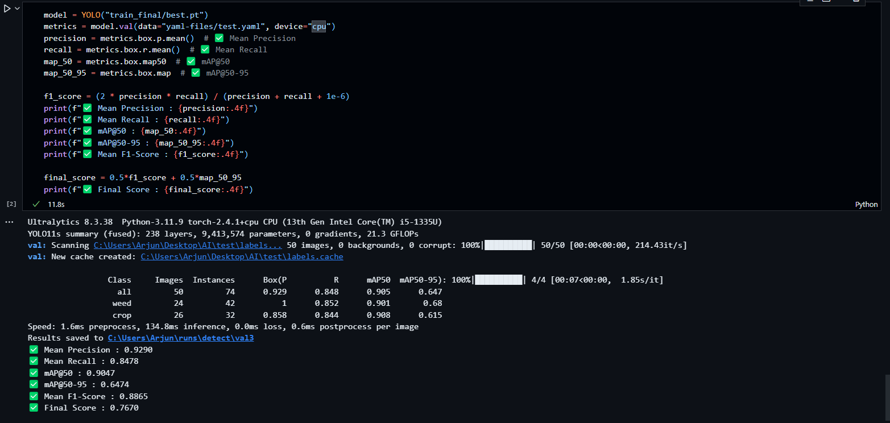

# Semi-Supervised Object Detection with Graph Neural Networks

This repository implements a semi-supervised learning approach for weed detection using YOLO and Graph Neural Networks. The system leverages both labeled and unlabeled data to improve detection performance through pseudo-labeling. The dataset is available [here](https://drive.google.com/drive/folders/1cGY1QHqNFiB2qkeL_rS0KtPDv54qk-Ks?usp=sharing). The detailed project report can be found [here](https://drive.google.com/file/d/1qe5sccHGi8ZNHXP75NCLnfC4XMNwUHSc/view?usp=sharing).

## Project Structure
```
├── src/
│   ├── __init__.py
│   ├── feature_extractor.py    # Feature extraction from images
│   ├── graph_constructor.py    # KNN graph construction
│   ├── gnn_model.py           # GNN model definition
│   ├── trainer.py             # Training logic
│   └── utils.py               # Utility functions
├── main.py                    # Main training script
├── requirements.txt           # Dependencies
└── README.md                  # This file
```
The `FINAL.ipynb` contains the training outputs performed on Kaggle. The notebook contains all the code with training as well as inference with proper file paths. This `notebook.ipynb` can be used for inference on the test data using the `yaml` files. The trained model file for the final inference is in the `train_final` folder with `best.pt` name. `EXTRA` folder contains the trained GNN model as `WEED.pt`.

## Installation

```bash
pip install -r requirements.txt
```

## Required Dependencies

- PyTorch
- PyTorch Geometric
- Ultralytics (YOLOv8)
- scikit-learn
- numpy
- Pillow

## Usage

1. Prepare your dataset in the following structure:
```
data/
├── labeled/
│   ├── images/
│   │   └── *.jpg
│   └── labels/
│       └── *.txt
└── unlabeled/
    └── *.jpg
```

2. Create YAML files for your dataset configuration:
- `dataset.yaml`: Initial training configuration
- `dataset_updated.yaml`: Configuration for final training
- `test.yaml`: Test dataset configuration

Edit the path in yaml files according to your setup. Try with the complete path in case the relative path is not read.
3. Run the training:
```bash
python main.py \
    --labeled_dir data/labeled \
    --unlabeled_dir data/unlabeled \
    --dataset_yaml path/to/dataset.yaml \
    --dataset_updated_yaml path/to/dataset_updated.yaml \
    --test_yaml path/to/test.yaml \
    --output_dir output \
    --yolo_model yolo11m.pt
```

## Command Line Arguments

- `--labeled_dir`: Directory containing labeled images and annotations
- `--unlabeled_dir`: Directory containing unlabeled images
- `--dataset_yaml`: Path to initial dataset YAML file
- `--dataset_updated_yaml`: Path to updated dataset YAML file
- `--test_yaml`: Path to test dataset YAML file
- `--output_dir`: Directory to save outputs
- `--yolo_model`: Path to pretrained YOLO model
- `--epochs`: Number of epochs (default: 500)
- `--batch_size`: Batch size (default: 32)
- `--learning_rate`: Initial learning rate (default: 0.0003)
- `--gnn_hidden_dim`: Hidden dimension for GNN (default: 128)
- `--confidence_threshold`: Threshold for pseudo-labeling (default: 0.9)

or

Run the initial cells in `notebook.ipynb` until the imports. After that run the last cells. Check that the path of the model passed to the YOLO is present at the path. 
`model = YOLO("train_final/best.pt")
metrics = model.val(data="yaml-files/test.yaml", device="cuda")`
set the device to cpu in case running on cpu 
`path: <path to the dataset directory>
train: labeled/images 
val: test/images 
test: test/images 
nc: 2  # Number of classes
names: ["weed", "crop"]
`

## Method Overview

1. **Initial YOLO Training**: Train YOLO model on labeled data
2. **Feature Extraction**: Extract features from both labeled and unlabeled images
3. **Graph Construction**: Build KNN graph from image features
4. **GNN Training**: Train GNN for pseudo-label generation
5. **Pseudo-labeling**: Generate labels for unlabeled images
6. **Final Training**: Retrain YOLO with both labeled and pseudo-labeled data

## Performance Metrics

The system evaluates performance using:
- Mean Precision
- Mean Recall
- mAP@50
- mAP@50-95
- F1-Score
- Final Score (0.5 * F1-Score + 0.5 * mAP@50-95)
